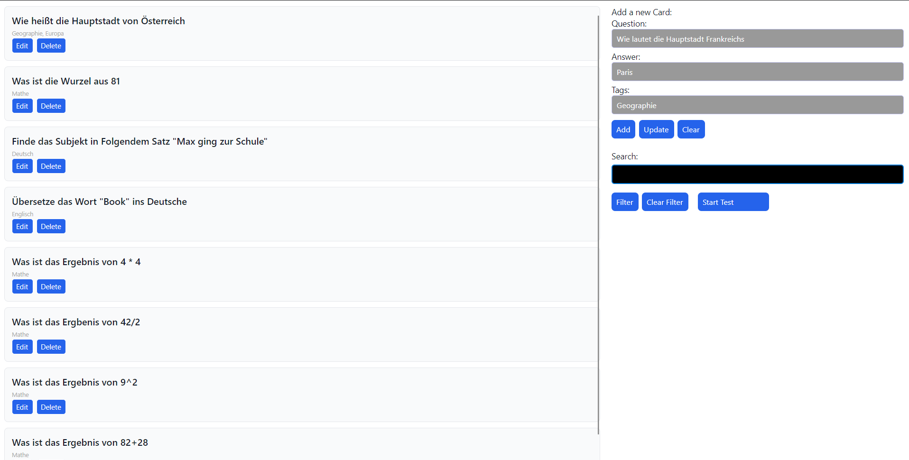
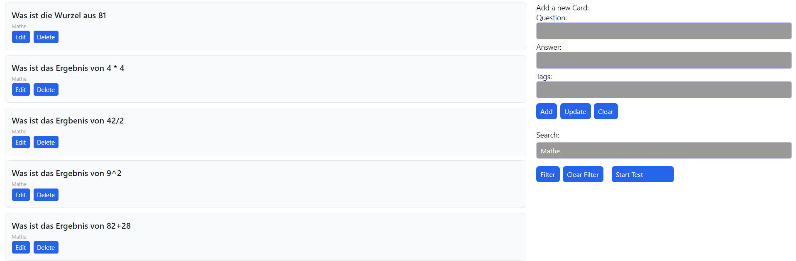
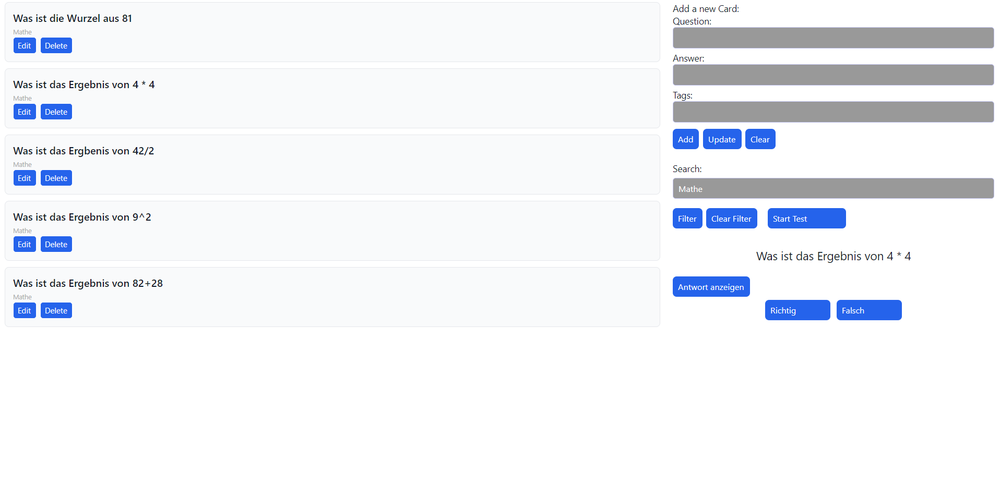

# FlashCards

FlashCards ist eine Avalonia-Anwendung zum Erstellen, Verwalten und Üben von Lernkarten (Flashcards). Die App richtet sich an Schüler, die Wissen effizient wiederholen und testen möchten.

Die Anwendung ermöglicht es, Karten mit Fragen, Antworten und optionalen Tags zu erstellen, zu bearbeiten und zu löschen. Zusätzlich bietet sie einen Testmodus, in dem Nutzer ihre Karten abfragen können und die richtigen Antworten gezählt werden. Durch den Filter kann man gezielt Karten zu bestimmten Themen üben.

## Spezifikationen:
### Problemstellung:
Viele Lernende benötigen eine einfache, digitale Möglichkeit, Lerninhalte in Frage-Antwort-Form zu wiederholen. FlashCards löst dies, indem es eine digitale Oberfläche zur Verwaltung und Abfrage von Lernkarten bereitstellt.

### Zielgruppe:
Die Zielgruppe sind Schüler und Nutzer die eine leichte Lern-App suchen.

### Workflow:
1. Kartenverwaltung:
    - Neue Karte erstellen (Frage, Antwort, Tags)
    - Bestehende Karten bearbeiten oder löschen
    - Karten filtern nach Tags oder Suchbegriffen
2. Testmodus:
    - Test starten (alle Karten oder gefilterte Karten)
    - Frage wird angezeigt, Antwort eingeblendet
    - Wenn der Nutzer die Antwort richtig hatte (Richtig), falls nicht (Falsch)
    - Testabschluss: Anzeige der Anzahl richtiger Antworten

## Technische Designs: 
### Architektur:
- MVVM (Model-View-ViewModel) für saubere Trennung von Logik und UI
- Views: Avalonia XAML-Fenster
- ViewModels: Verwaltung der Logik, Commands und Bindings
- Models: Card-Entität für die SQLite-Datenbank
- Datenbank: SQLite mit Entity Framework Core
- Model: 
    ```
    public class Card
    {
        public int Id { get; set; }
        public string Question { get; set; }
        public string Answer { get; set; }
        public string Tags { get; set; }
    }

### Bindings:
Two-Way-Bindings für Eingabefelder und Einweg-Bindings für Anzeigeelemente.

### Styling und Layout:

- Grid für Hauptaufteilung (Liste links, Eingaben/Filter/Testmodus rechts)
- StackPanel für vertikale Eingaben, Filterbuttons und Testmodus
- Karten optisch abgehoben durch Border mit Padding, CornerRadius und Margin
- Konsistente Farbpalette (Blau für Buttons, Weiß für Hintergründe, Grau für Text)

### Images:

- Eine neue Card erstellen mit Frage, Antwort und Tags

- Nach Tag filtern zum Beispiel Mathe

- Testmodus mit Anzeige der Frage und Antwort (in diesem Fall nach Mathe gefiltert)
